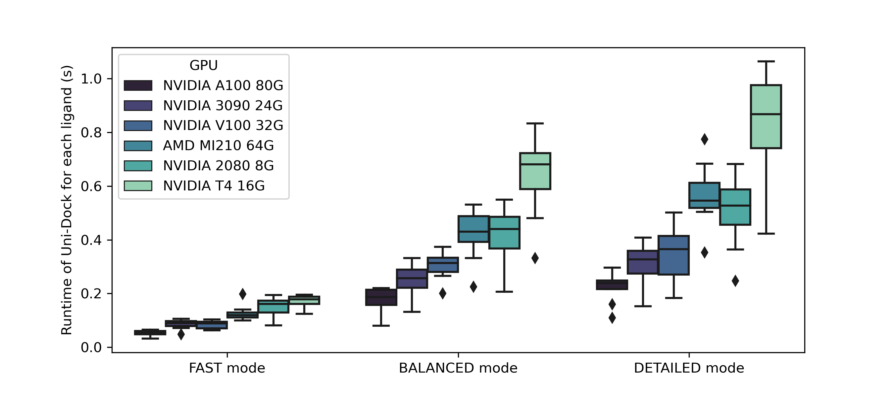

# Uni-Dock

Uni-Dock is a GPU-accelerated molecular docking program developed by DP Technology.
It supports various scoring functions including vina, vinardo, and ad4.
Uni-Dock achieves more than 1000-fold speed-up on V100 GPU with high-accuracy compared with the AutoDock Vina running in single CPU core.
The [paper](https://pubs.acs.org/doi/10.1021/acs.jctc.2c01145) has been accepted by JCTC (doi: 10.1021/acs.jctc.2c01145).



## Usage Guideline

We offer the software **for academic purposes only**. By downloading and using Uni-Dock, you are agreeing to the usage guideline ([en](https://github.com/dptech-corp/Uni-Dock/blob/main/license/usage-guidelines-en.md), [zh](https://github.com/dptech-corp/Uni-Dock/blob/main/license/usage-guidelines-zh.md)).

Developed by [DP Technology](https://dp.tech/en), [Hermite®](https://dp.tech/en/product/hermite) is a new-generation drug computing design platform which integrates artificial intelligence, physical modeling and high-performance computing to provide a one-stop computing solution for preclinical drug research and development. It integrates the features of Uni-Dock, along with virtual screening workflow for an efficient drug discovery process.

Uni-Dock is now available on the new-generation drug computing design platform [Hermite®](https://dp.tech/en/product/hermite) for ultralarge virtual screening.

For commercial usage and further cooperations, please contact us at bd@dp.tech .

## Installation

Uni-Dock supports NVIDIA GPUs on Linux platform.
[CUDA toolkit](https://developer.nvidia.com/cuda-downloads) is required.

Please download the latest binary of Uni-Dock at the assets tab of [the Release page](https://github.com/dptech-corp/Uni-Dock/releases).
Executable `unidock` supports vina and vinardo scoring functions, and `unidock_ad4` supports ad4 scoring function.

After downloading, please make sure that the path to `unidock` is in your `PATH` environment variable.

## Usage

### Example

To launch a Uni-Dock job, the most important parameters are as follows:

- `--receptor`: filepath of the receptor (PDBQT)
- `--gpu_batch`: filepath of the ligands to dock with GPU (PDBQT), enter multiple at a time, separated by spaces (" ")
- `--search_mode`: computational complexity, choice in [*`fast`*, *`balance`*, and *`detail`*].

***Advanced options***
`--search_mode` is the recommended setting of `--exhaustiveness` and `--max_step`, with three combinations called `fast`, `balance`, and `detail`.

- `fast` mode: `--exhaustiveness 128` & `--max_step 20`
- `balance` mode: `--exhaustiveness 384` & `--max_step 40`
- `detail` mode: `--exhaustiveness 512` & `--max_step 40`

The larger `--exhaustiveness` and `--max_step`, the higher the computational complexity, the higher the accuracy, but the larger the computational cost.

```bash
unidock --receptor <receptor.pdbqt> \
     --gpu_batch <lig1.pdbqt> <lig2.pdbqt> ... <ligN.pdbqt> \
     --search_mode balance \
     --scoring vina \
     --center_x <center_x> \
     --center_y <center_y> \
     --center_z <center_z> \
     --size_x <size_x> \
     --size_y <size_y> \
     --size_z <size_z> \
     --num_modes 1 \
     --dir <save dir>
```

### Parameters

```shell
>> unidock --help

Input:
  --receptor arg             rigid part of the receptor (PDBQT)
  --flex arg                 flexible side chains, if any (PDBQT)
  --ligand arg               ligand (PDBQT)
  --ligand_index arg         file containing paths to ligands
  --batch arg                batch ligand (PDBQT)
  --gpu_batch arg            gpu batch ligand (PDBQT)
  --scoring arg (=vina)      scoring function (ad4, vina or vinardo)

Search space (required):
  --maps arg                 affinity maps for the autodock4.2 (ad4) or vina
                             scoring function
  --center_x arg             X coordinate of the center (Angstrom)
  --center_y arg             Y coordinate of the center (Angstrom)
  --center_z arg             Z coordinate of the center (Angstrom)
  --size_x arg               size in the X dimension (Angstrom)
  --size_y arg               size in the Y dimension (Angstrom)
  --size_z arg               size in the Z dimension (Angstrom)
  --autobox                  set maps dimensions based on input ligand(s) (for
                             --score_only and --local_only)

Output (optional):
  --out arg                  output models (PDBQT), the default is chosen based
                             on the ligand file name
  --dir arg                  output directory for batch mode
  --write_maps arg           output filename (directory + prefix name) for
                             maps. Option --force_even_voxels may be needed to
                             comply with .map format

Misc (optional):
  --cpu arg (=0)             the number of CPUs to use (the default is to try
                             to detect the number of CPUs or, failing that, use
                             1)
  --seed arg (=0)            explicit random seed
  --exhaustiveness arg (=8)  exhaustiveness of the global search (roughly
                             proportional to time): 1+
  --max_evals arg (=0)       number of evaluations in each MC run (if zero,
                             which is the default, the number of MC steps is
                             based on heuristics)
  --num_modes arg (=9)       maximum number of binding modes to generate
  --min_rmsd arg (=1)        minimum RMSD between output poses
  --energy_range arg (=3)    maximum energy difference between the best binding
                             mode and the worst one displayed (kcal/mol)
  --spacing arg (=0.375)     grid spacing (Angstrom)
  --verbosity arg (=1)       verbosity (0=no output, 1=normal, 2=verbose)
  --max_step arg (=0)        maximum number of steps in each MC run (if zero,
                             which is the default, the number of MC steps is
                             based on heuristics)
  --max_gpu_memory arg (=0)  maximum gpu memory to use (default=0, use all
                             available GPU memory to optain maximum batch size)
  --search_mode arg          search mode of unidock (fast, balance, detail), using
                             recommended settings of exhaustiveness and search
                             steps; the higher the computational complexity,
                             the higher the accuracy, but the larger the
                             computational cost

Configuration file (optional):
  --config arg               the above options can be put here

Information (optional):
  --help                     display usage summary
  --help_advanced            display usage summary with advanced options
  --version                  display program version
```

## Examples

We have provided a target from DUD-E dataset for screening test. Python version `>=3.6` is recommended.

```bash
git clone https://github.com/dptech-corp/Uni-Dock.git
cd Uni-Dock/example/screening_test

# target def
cp config_def.json config.json
python run_dock.py

# target mmp13
cp config_mmp13.json config.json
python run_dock.py
```

If you want to use search mode presets, specify the parameter `search_mode` in `config.json` and delete `nt` and `ns` in `config.json`.

## Bug Report

Please report bugs to [Issues](https://github.com/dptech-corp/Uni-Dock/issues) page.

## Ackowledgement

If you used Uni-Dock in your work, please cite:

Yu, Y., Cai, C., Wang, J., Bo, Z., Zhu, Z., & Zheng, H. (2023).
Uni-Dock: GPU-Accelerated Docking Enables Ultralarge Virtual Screening.
Journal of Chemical Theory and Computation.
https://doi.org/10.1021/acs.jctc.2c01145

Tang, S., Chen, R., Lin, M., Lin, Q., Zhu, Y., Ding, J., ... & Wu, J. (2022).
Accelerating autodock vina with gpus. Molecules, 27(9), 3041.
DOI 10.3390/molecules27093041

J. Eberhardt, D. Santos-Martins, A. F. Tillack, and S. Forli
AutoDock Vina 1.2.0: New Docking Methods, Expanded Force
Field, and Python Bindings, J. Chem. Inf. Model. (2021)
DOI 10.1021/acs.jcim.1c00203

O. Trott, A. J. Olson,
AutoDock Vina: improving the speed and accuracy of docking
with a new scoring function, efficient optimization and
multithreading, J. Comp. Chem. (2010)
DOI 10.1002/jcc.21334

## FAQ

1. The GPU encounters out-of-memory error.
Uni-Dock estimates the number of ligands put into GPU memory in one pass based on the available GPU memory size. If it fails, please use `--max_gpu_memory` to limit the usage of GPU memory size by Uni-Dock.
2. I want to put all my ligands in `--gpu_batch`, but it exceeds the maximum command line length that linux can accept.
    - You can save your command in a shell script like `run.sh`, and run the command by `bash run.sh`.
    - You can save your ligands path in a file (separated by spaces) by `ls *.pdbqt > index.txt`, and use `--ligand_index index.txt` in place of `--gpu_batch`.
