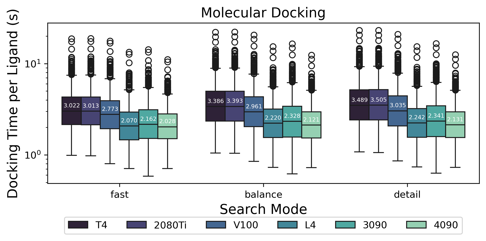
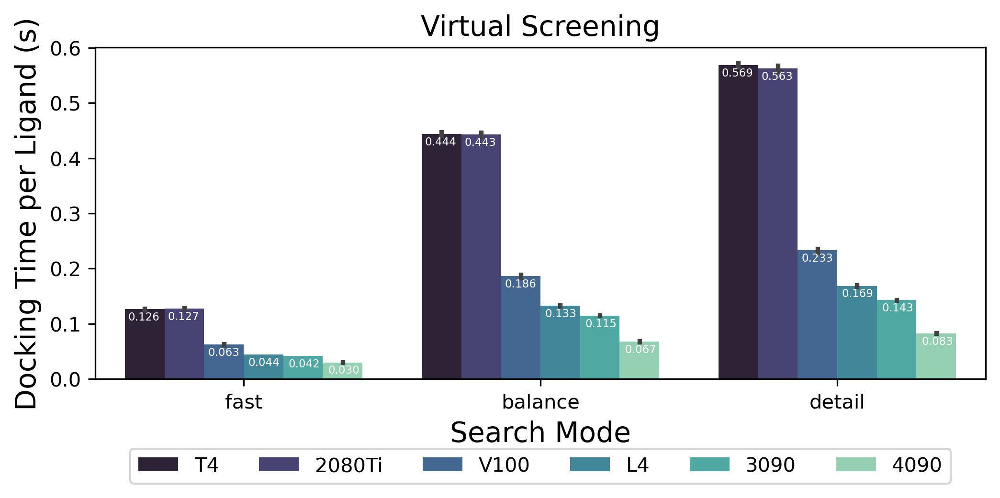

# Uni-Dock

<picture><source media="(prefers-color-scheme: dark)" srcset="./unidock/assets/logo-dark.svg"><source media="(prefers-color-scheme: light)" srcset="./unidock/assets/logo.svg"></picture>

**Uni-Dock** is a GPU-accelerated molecular docking program developed by DP Technology.
It supports various scoring functions including vina, vinardo, and ad4. Uni-Dock achieves more than 2000-fold speed-up on V100 GPU with high-accuracy compared with the AutoDock Vina running in single CPU core.
The [paper](https://pubs.acs.org/doi/10.1021/acs.jctc.2c01145) has been accepted by JCTC (doi: 10.1021/acs.jctc.2c01145).

**Uni-Dock** joins the DeepModeling community, a community devoted of AI for science, as an incubating level project. [Learn more about DeepModeling](https://github.com/deepmodeling/community)

Please check [`unidock` folder](./unidock/) for installing instructions, source codes, and usage.

---

**Uni-Dock Tools** is a Python package developed to handle the inputs and outputs of Uni-Dock.
It is committed to support more input formats and scoring functions. We hope it could be an easy-to-use virtual screening workflow for users with diversed backgrounds.

Please check [`unidock_tools` folder](./unidock_tools/) for installing instructions, source codes, and usage.

---

To evaluate the performance and accuracy under a uniform standard, we created **Uni-Dock Benchmarks** based on public datasets and papers.
The benchmarks are publicly available at <https://github.com/dptech-corp/Uni-Dock-Benchmarks>.

## Changelog
- 2025-03-10: Relicense the entire repository under Apache 2.0.
- 2024-02-29: Release [Uni-Dock v1.1](./unidock/README.md#changelog) and [Uni-Dock Tools](./unidock_tools/README.md).
- 2023-08-21: Upload source codes of Uni-Dock.
- 2023-08-14: Add Uni-Dock Tools to support SDF format input for vina and vinardo scoring functions.

## License
Uni-Dock is licensed under the **Apache License 2.0**.

Previously, the `unidock/` directory was licensed under LGPL 3, but as of **March 10, 2025**, the entire repository has been relicensed under Apache 2.0 for better consistency and compatibility.

## Citation

If you used Uni-Dock in your work, please cite:

Yu, Y., Cai, C., Wang, J., Bo, Z., Zhu, Z., & Zheng, H. (2023).
Uni-Dock: GPU-Accelerated Docking Enables Ultralarge Virtual Screening.
Journal of Chemical Theory and Computation.
https://doi.org/10.1021/acs.jctc.2c01145
