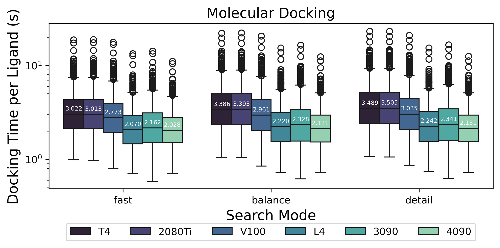
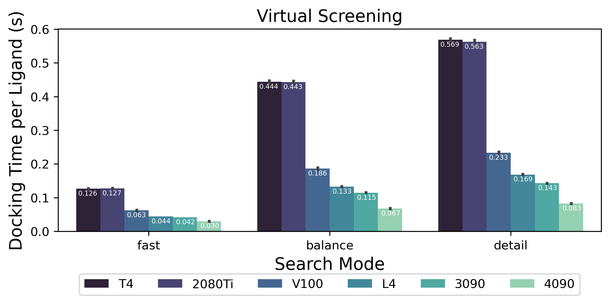

# Uni-Dock

Uni-Dock is a GPU-accelerated molecular docking program developed by DP Technology.
It supports various scoring functions including vina, vinardo, and ad4.
Uni-Dock achieves more than 2000-fold speed-up on V100 GPU with high-accuracy compared with the AutoDock Vina running in single CPU core.
The [paper](https://pubs.acs.org/doi/10.1021/acs.jctc.2c01145) has been accepted by JCTC (doi: 10.1021/acs.jctc.2c01145).




## Installation

Uni-Dock officially supports NVIDIA GPUs with [compute capability](https://en.wikipedia.org/wiki/CUDA#GPUs_supported) >= 7.0 on Linux platform.
The performance is not guaranteed on legacy GPU models. To build Uni-Dock with a customized compute capability, please change the `CMAKE_CUDA_ARCHITECTURES` variable in `CMakeLists.txt` to the corresponding value.

### Installing by Conda

Conda is a package management system with a separated environment, not requiring system privileges.
You can refer to [DeepModeling conda FAQ](https://docs.deepmodeling.com/faq/conda.html) for how to setup a conda environment.
A pre-built Uni-Dock binary with all requirements is available at [conda-forge](https://anaconda.org/conda-forge/unidock).

```bash
# Install
# We recommend installing Uni-Dock in a new environment to avoid potential conflicts:
conda create -n unidock_env unidock -c conda-forge
# Run
conda activate unidock_env
unidock --help
# Update
conda update -n unidock_env unidock -c conda-forge
```

### Building from source

1. Install dependencies

     - CUDA toolkit >= 11.8: Please refer to the [installation tutorial](https://docs.nvidia.com/cuda/cuda-installation-guide-linux/index.html) provided by nvidia.
     - CMake >= 3.16
     - A C++ compiler (should be [compatible with NVCC](https://docs.nvidia.com/cuda/cuda-installation-guide-linux/index.html#host-compiler-support-policy); `g++` works for most cases)
     - Boost >= 1.72

          ```bash
          sudo apt install libboost-system-dev libboost-thread-dev libboost-serialization-dev libboost-filesystem-dev libboost-program-options-dev libboost-timer-dev
          ```

          Alternatively, download Boost from source by adding `-D FETCH_BOOST=ON` when compiling (see step 3).

          If the above methods don't satisify, install from [boost source codes](https://www.boost.org/users/download/) or from [anaconda](https://anaconda.org/anaconda/libboost) with `conda install -c anaconda libboost`.

2. Clone repo or retrieve source code from [release page](https://github.com/dptech-corp/Uni-Dock/releases):

   ```bash
   git clone https://github.com/dptech-corp/Uni-Dock.git
   ```

3. Build Uni-Dock using CMake:

     ```bash
     cd Uni-Dock/unidock
     cmake -B build
     # or the following if you want to use FetchContent to install boost
     # cmake -B build -D FETCH_BOOST=ON
     cmake --build build -j4
     cmake --install build # This will add `unidock` to the default installation path for executables.
                           # Otherwise, prepend the building directory to your `PATH` environment variable.
     ```

To format codes if changes are made:

```shell
cd ./build/
make clang-format
```

## Usage

### Example

To launch a Uni-Dock job, the most important parameters are as follows:

- `--receptor`: filepath of the receptor (PDBQT)

     (If you want to use `ad4` scoring function, you need to generate affinity maps first and use `--maps <mapdir/receptor_prefix>` instead of `--receptor`. The method to generate maps is in [here](https://autodock-vina.readthedocs.io/en/latest/docking_basic.html#optional-generating-affinity-maps-for-autodock-ff))

- `--gpu_batch`: filepath of the ligands to dock with GPU (PDBQT), enter multiple at a time, separated by spaces (" ")

- `--search_mode`: computational complexity, choose in \[*`fast`*, *`balance`*, and *`detail`*].

***Advanced options***
`--search_mode` is the recommended setting of `--exhaustiveness` and `--max_step`, with three combinations called `fast`, `balance`, and `detail`.

- `fast` mode: `--exhaustiveness 128` & `--max_step 20`
- `balance` mode: `--exhaustiveness 384` & `--max_step 40`
- `detail` mode: `--exhaustiveness 512` & `--max_step 40`

The larger `--exhaustiveness` and `--max_step`, the higher the computational complexity, the higher the accuracy, but the larger the computational cost.

```bash
unidock --receptor <receptor.pdbqt> \
     --gpu_batch <lig1.pdbqt> <lig2.pdbqt> ... <ligN.pdbqt> \
     --search_mode balance \
     --scoring vina \
     --center_x <center_x> \
     --center_y <center_y> \
     --center_z <center_z> \
     --size_x <size_x> \
     --size_y <size_y> \
     --size_z <size_z> \
     --num_modes 1 \
     --dir <save dir>
```

### Parameters

```shell
>> unidock --help

Input:
  --receptor arg             rigid part of the receptor (PDBQT or PDB)
  --flex arg                  flexible side chains, if any (PDBQT or PDB)
  --ligand arg               ligand (PDBQT)
  --ligand_index arg         file containing paths to ligands (PDBQT or SDF)
  --batch arg                batch ligand (PDBQT)
  --gpu_batch arg            gpu batch ligand (PDBQT or SDF)
  --scoring arg (=vina)      scoring function (ad4, vina or vinardo)

Search space (required):
  --maps arg                 affinity maps for the autodock4.2 (ad4) or vina
                             scoring function
  --center_x arg             X coordinate of the center (Angstrom)
  --center_y arg             Y coordinate of the center (Angstrom)
  --center_z arg             Z coordinate of the center (Angstrom)
  --size_x arg               size in the X dimension (Angstrom)
  --size_y arg               size in the Y dimension (Angstrom)
  --size_z arg               size in the Z dimension (Angstrom)
  --autobox                  set maps dimensions based on input ligand(s) (for
                             --score_only and --local_only)

Output (optional):
  --out arg                  output models (PDBQT), the default is chosen based
                             on the ligand file name
  --dir arg                  output directory for batch mode
  --write_maps arg           output filename (directory + prefix name) for
                             maps. Option --force_even_voxels may be needed to
                             comply with .map format

Misc (optional):
  --cpu arg (=0)             the number of CPUs to use (the default is to try
                             to detect the number of CPUs or, failing that, use
                             1)
  --seed arg (=0)            explicit random seed
  --exhaustiveness arg (=8)  exhaustiveness of the global search (roughly
                             proportional to time): 1+
  --max_evals arg (=0)       number of evaluations in each MC run (if zero,
                             which is the default, the number of MC steps is
                             based on heuristics)
  --num_modes arg (=9)       maximum number of binding modes to generate
  --min_rmsd arg (=1)        minimum RMSD between output poses
  --energy_range arg (=3)    maximum energy difference between the best binding
                             mode and the worst one displayed (kcal/mol)
  --spacing arg (=0.375)     grid spacing (Angstrom)
  --verbosity arg (=1)       verbosity (0=no output, 1=normal, 2=verbose)
  --max_step arg (=0)        maximum number of steps in each MC run (if zero,
                             which is the default, the number of MC steps is
                             based on heuristics)
  --refine_step arg (=5)     number of steps in refinement, default=5
  --max_gpu_memory arg (=0)  maximum gpu memory to use (default=0, use all
                             available GPU memory to optain maximum batch size)
  --search_mode arg          search mode of unidock (fast, balance, detail), using
                             recommended settings of exhaustiveness and search
                             steps; the higher the computational complexity,
                             the higher the accuracy, but the larger the
                             computational cost

Configuration file (optional):
  --config arg               the above options can be put here

Information (optional):
  --help                     display usage summary
  --help_advanced            display usage summary with advanced options
  --version                  display program version
```

## Examples

We have provided a target from DUD-E dataset for screening test. Python version `>=3.6` is recommended.

```bash
git clone https://github.com/dptech-corp/Uni-Dock.git
cd Uni-Dock/unidock/example/screening_test

# target def
cp config_def.json config.json
python run_dock.py

# target mmp13
cp config_mmp13.json config.json
python run_dock.py
```

If you want to use search mode presets, specify the parameter `search_mode` in `config.json` and delete `nt` and `ns` in `config.json`.

## Contributing

We warmly welcome contributions from the open source community. Your bug reports, feature requests, and pull requests helps Uni-Dock improve.

Please submit bug reports and feature requests to the Github [issue tracker](https://github.com/dptech-corp/Uni-Dock/issues/new/choose).

If you would like to improve the codes, please refer to the [contributing guide](../.github/CONTRIBUTING.md) for details.

## Changelog

Major changes are documented. For the detailed changes, please refer to the commit history.

### v1.1

- Optimize 1:1 ligand docking.
- Optimize Monte-Carlo simulation speed.
- Generate compute kernels for various ligands sizes.

## License

This project is licensed under the terms of the **Apache License Version 2.0**. See [LICENSE](../LICENSE) for details.

Previously, the Uni-Dock project was licensed under LGPL 3, but as of **March 10, 2025**, the entire repository has been relicensed under Apache 2.0 for better consistency and compatibility.

Developed by [DP Technology](https://dp.tech/en), [Hermite®](https://dp.tech/en/product/hermite) is a new-generation drug computing design platform which integrates artificial intelligence, physical modeling and high-performance computing to provide a one-stop computing solution for preclinical drug research and development. It integrates the features of Uni-Dock, along with virtual screening workflow for an efficient drug discovery process.

Uni-Dock is now available on the new-generation drug computing design platform [Hermite®](https://dp.tech/en/product/hermite) for ultralarge virtual screening.

For further cooperations on developing Uni-Dock and trying out Hermite®, please contact us at <bd@dp.tech> .

## Ackowledgement

If you used Uni-Dock in your work, please cite:

Yu, Y., Cai, C., Wang, J., Bo, Z., Zhu, Z., & Zheng, H. (2023).
Uni-Dock: GPU-Accelerated Docking Enables Ultralarge Virtual Screening.
Journal of Chemical Theory and Computation.
<https://doi.org/10.1021/acs.jctc.2c01145>

Tang, S., Chen, R., Lin, M., Lin, Q., Zhu, Y., Ding, J., ... & Wu, J. (2022).
Accelerating autodock vina with gpus. Molecules, 27(9), 3041.
DOI 10.3390/molecules27093041

J. Eberhardt, D. Santos-Martins, A. F. Tillack, and S. Forli
AutoDock Vina 1.2.0: New Docking Methods, Expanded Force
Field, and Python Bindings, J. Chem. Inf. Model. (2021)
DOI 10.1021/acs.jcim.1c00203

O. Trott, A. J. Olson,
AutoDock Vina: improving the speed and accuracy of docking
with a new scoring function, efficient optimization and
multithreading, J. Comp. Chem. (2010)
DOI 10.1002/jcc.21334

## FAQ

1. The GPU encounters out-of-memory error.

     Uni-Dock estimates the number of ligands put into GPU memory in one pass based on the available GPU memory size. If it fails, please use `--max_gpu_memory` to limit the usage of GPU memory size by Uni-Dock.

2. I want to put all my ligands in `--gpu_batch`, but it exceeds the maximum command line length that linux can accept.
    - You can save your command in a shell script like `run.sh`, and run the command by `bash run.sh`.
    - You can save your ligands path in a file (separated by spaces) by `ls *.pdbqt > index.txt`, and use `--ligand_index index.txt` in place of `--gpu_batch`.

3. Uni-Dock computes slowly for few (<10) ligands.

     The optimal application of Uni-Dock occurs in scenarios where one binding pocket interacts with numerous (in an order of 1000) ligands. As the number of ligands within a single computational batch increases, the average processing speed improves. In instances where only a few ligands are present for one binding pocket, the overhead proportion becomes considerably large, leading to slower computational performance.

4. Which GPU architectures does Uni-Dock support?

     Starting from v1.1, Uni-Dock supports NVIDIA GPUs with [compute capability](https://en.wikipedia.org/wiki/CUDA#GPUs_supported) >= 7.0 . Uni-Dock v1.0 supports both CUDA platform for NVIDIA GPUs and ROCm platform for AMD GPUs. Since the performance optimizations are targeted at CUDA, future updates will no longer support the ROCm platform.

### Addendum to "FAQ 3 - Uni-Dock computes slowly for few (<10) ligands."

The `paired_batch` mode provides a mechanism to accelerate simultaneous 1:1 docking in batches using Vina scoring, using CUDA streams. To run docking using this mode, invoke unidock with the parameter `--paired_batch_size` value >0, with the protein:ligand configurations passed in JSON form using `--ligand_index`. The JSON file should use schema defined in paired_batching.schema.json.

A sample input data.json is as below, complying to the schema:

```json
{
    "7LCU": {
        "protein": "molecular_docking/PoseBuster/7LCU/7LCU_receptor.pdbqt",
        "ligand": "molecular_docking/PoseBuster/7LCU/7LCU_ligand_prep.sdf",
        "ligand_config": "molecular_docking/PoseBuster/7LCU/docking_grid.json"
    },
    "7KZ9": {
        "protein": "molecular_docking/PoseBuster/7KZ9/7KZ9_receptor.pdbqt",
        "ligand": "molecular_docking/PoseBuster/7KZ9/7KZ9_ligand_prep.sdf",
        "ligand_config": "molecular_docking/PoseBuster/7KZ9/docking_grid.json"
    }
}
```

A typical usage using paired_batch mode is as shown below, with batch size of 10.

```bash
unidock --paired_batch_size 10 --ligand_index data_pb1.json --size_x 25 --size_y 25 --size_z 25 --dir test/prof_25_1024_80 --exhaustiveness 1024 --max_step 80 --seed 5
```
